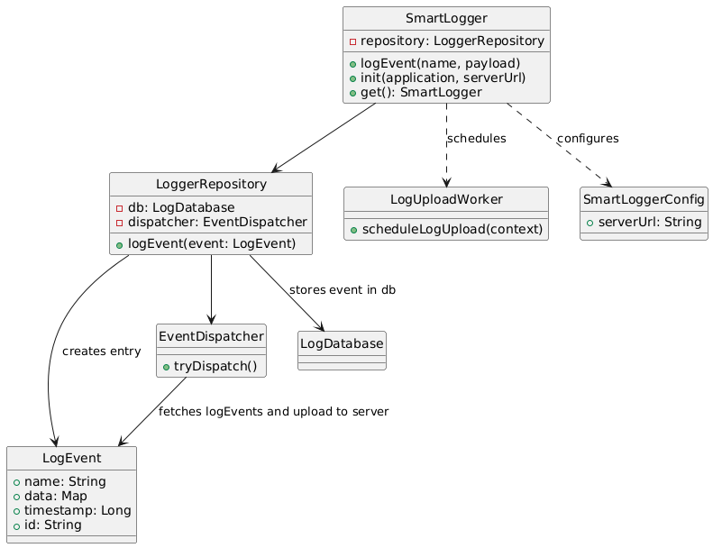

SmartLogger application, and library (smartlogger)
-
 - Application includes the library smartlogger and starts logging events by:  
   Step 1) SmartLogger.init(this, "your_server_url") //resides in application class to initialize library.  
   Step 2)  SmartLogger.get().logEvent(eventName, payload) //logs the event with map object payload.
- The logging events are thread safe so the host app can call logEvent from any thread.
- Logging process will be carried out internally on worker threads.

Expectation from host app (integration)
-
 - Pass the valid server url where the logs can be pushed as map object.
 - Application must have internet permission (normal permission no user intervention is req. and 
  network connectivity permission) as added in app manifest file.

  
WorkFlow
- 
- Right now if the device is online it will push the data immediately.
- If it's offline it will keep storing it locally.

 - If the device comes back online, and user reacts(any event) it will kick back and will sync data. 
 - For more complex logic we can observer network state using BroadcastReceiver for listening network events

Components used:
- 
- Room db : for storing events locally and managing records.
- WorkManager api: for periodic sync (logs upload process) which survives process death, device reboot.
- okhttp library: for making network calls.
- convertors and gson: for data mapping and serialising data.

Architecture
- 
- Library smartlogger follows the path of clean architecture, using separation of concerns 
  and layered responsibilities as: 
   - Core Entry Point: SmartLogger 
   - Repository Layer: LoggerRepository 
   - Model Layer: LogEvent, Converters 
   - Data Layer: Room, WorkManager, NetworkDispatcher

## Class relationship

